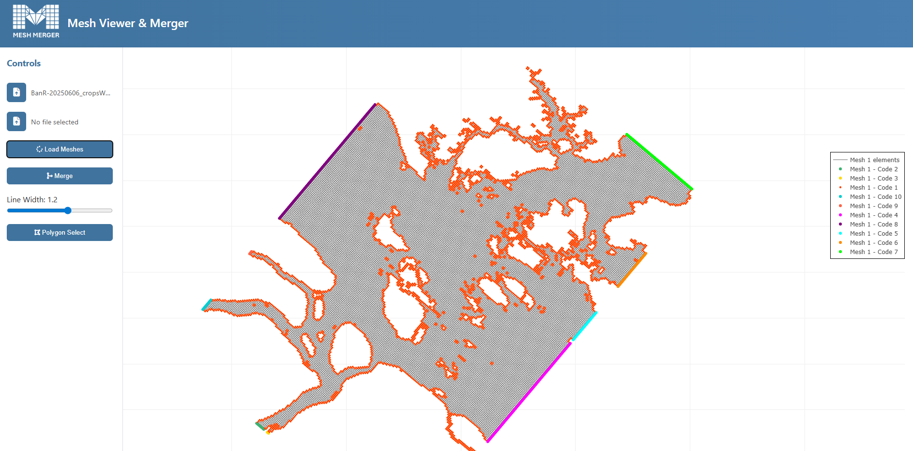
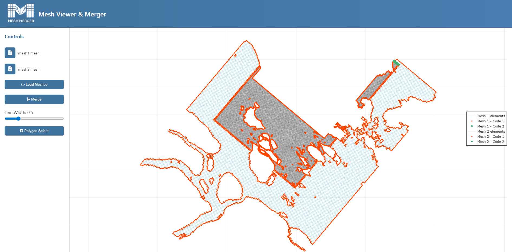
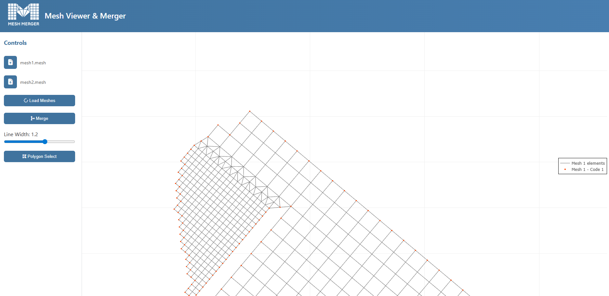
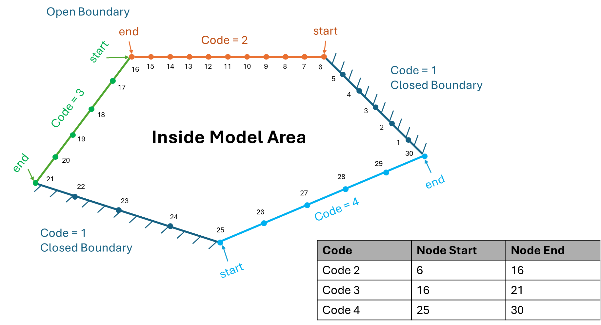

<p align="center">
  
</p>

<p align="center">
  <b>A Python-based utility for merging MIKE meshes with interactive boundary selection</b>
</p>

---

## 📸 Screenshots

<p align="center">
  
</p>

<p align="center">
  
</p>

<p align="center">
  
</p>

---

## ⚙️ Installation

1. **Clone or download the repository**
   ```bash
   git clone https://github.com/mohm-dhi/MeshMerger.git
   cd MeshMerger
   ```

2. **Install required dependencies**  
   The tool requires Python 3.9+ and the following packages:
   ```bash
   pip install -r requirements.txt
   ```
   Or install manually:
   ```bash
   pip install numpy matplotlib flask triangle werkzeug mikeio
   ```
   finally install the package:
   ```bash
   pip install .
   ```
   or for editable version:
   ```bash
   pip install -e .
   ```
  to run the application type 
  ```bash
   > meshmerger
   ```
   in the cmd. the following screen showed and you can open the application in your web-browser from the localhost link. 
  ```bash
    > meshmerger
    * Serving Flask app 'meshmerger.app'
    * Debug mode: off
    WARNING: This is a development server. Do not use it in a production deployment. Use a production WSGI server instead.
    * Running on all addresses (0.0.0.0)
    * Running on http://127.0.0.1:5000
    * Running on http://192.168.2.42:5000
  ```


3. **Prepare your meshes**  
   Convert `.dfs2` files into mesh format using either:
   - The provided Python script:  
   - Or using **MIKE Toolbox**

---

## 🚀 Usage

1. **Start the software** and load the two mesh files you want to merge.  

2. **Define merge boundary** using:
   - **Lasso tool**, or
   - **Polygon selection tool**

   ⚠️ Important:
   - **MIKE mesh boundary codes must follow counterclockwise orientation**
   - See the [MIKE Manual](https://doc.mikepoweredbydhi.help/webhelp/2025/MeshEdit/index.htm) for boundary coding rules or define them accourding to instructions in the figure below: 
   <p align="center">
  
</p>

3. **Click "Merge"**  
   - The meshes will be merged along your defined boundary.  

4. **Output**  
   - The merged mesh is stored in:
     ```
     C:\temp\
     ```

---

## 🧭 Example Workflow

1. Convert `.dfs2` → `.mesh`:
   ```bash
   dfs2_to_mesh mesh1.dfs2 mesh1.mesh
   dfs2_to_mesh mesh2.dfs2 mesh2.mesh
   ```

2. Launch the software and load both meshes.  

3. Define the boundary using **lasso** or **polygon selection** tool follow the video instruction below:

4. Click **Merge**.  

5. Retrieve merged result from `C:\temp\`.  

## Video Instruction:


---

## 📖 Notes

- Always ensure boundary selection follows **counterclockwise rotation**.  
- For large meshes, ensure your system has sufficient memory.  
- Check the **MIKE Mesh Manual** for detailed boundary rules.  

---

<p align="center">
  <i>Developed for seamless mesh merging in hydrodynamic modeling workflows.</i>
</p>
